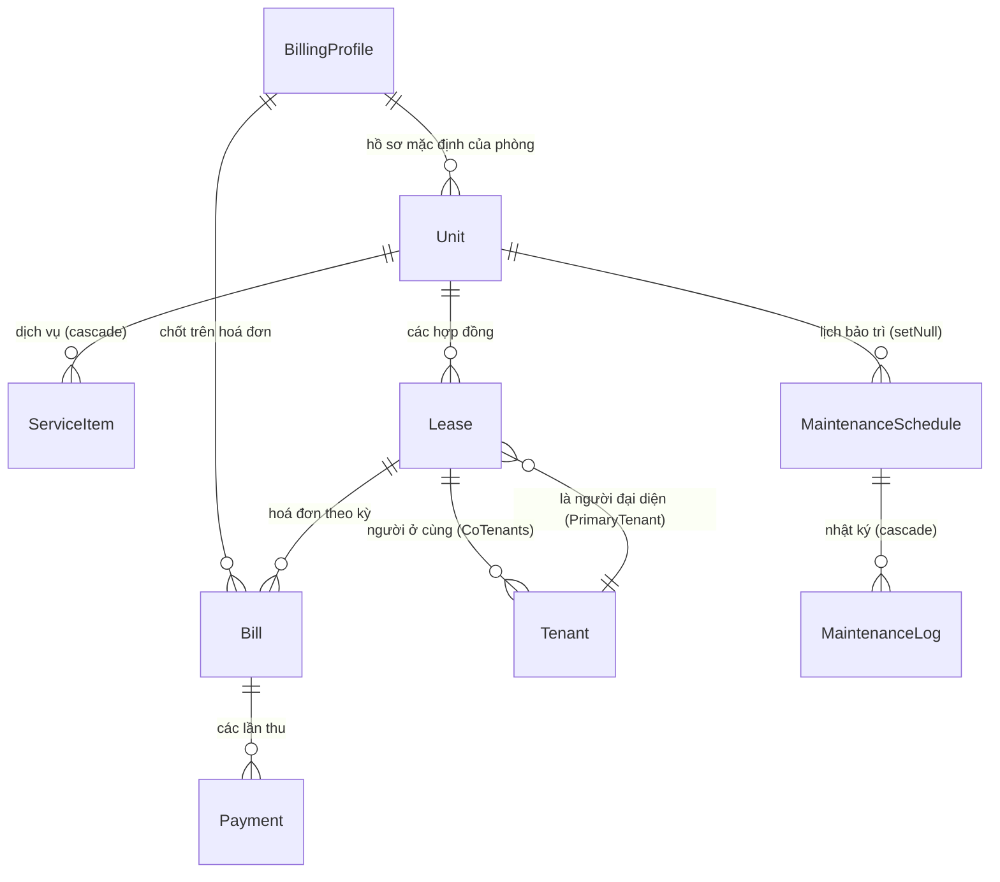

# Đặc tả Yêu cầu Phần mềm (SRS) — Quản Lý Nhà Trọ

> **Tài liệu nguồn (source of truth) hiện hành.** Bản này thay thế
> `docs/superpowers/specs/2026-06-18-rental-management-design.md` (bản thiết kế
> ban đầu, nay đã lạc hậu: chưa có hồ sơ thanh toán, người ở cùng, chỉ số
> điện/nước, quản lý người dùng…).
>
> - **Phiên bản:** 1.0
> - **Cập nhật:** 2026-07-01
> - **Phạm vi mã nguồn:** nhánh `master` (đã gộp tới PR #11 — multi-tenant &
>   flexible billing)
> - **Trạng thái:** Giai đoạn 1 (nội bộ / chỉ admin)

---

## 1. Giới thiệu

### 1.1 Mục đích
Tài liệu mô tả yêu cầu chức năng, phi chức năng, mô hình dữ liệu và các quy tắc
nghiệp vụ của hệ thống **Quản Lý Nhà Trọ** — ứng dụng web quản lý một toà nhà
cho thuê của gia đình tại Việt Nam. Tài liệu dùng làm căn cứ thống nhất giữa
phát triển, kiểm thử và vận hành, đồng thời ghi nhận các kết nối (integration)
với dịch vụ ngoài.

### 1.2 Phạm vi
Toà nhà gồm **15 phòng ở** (3 tầng × 5 phòng) và **1 mặt bằng thương mại** ở
tầng trệt (hiện cho một phòng gym thuê) — tổng **16 đơn vị (unit)**. Giai đoạn 1
phục vụ nội bộ (chủ nhà/admin): quản lý phòng, khách thuê, hợp đồng, hoá đơn,
thu chi, sổ sách, bảo trì và nhắc nợ qua Zalo. Cổng thông tin cho khách thuê
được hoãn sang Giai đoạn 2.

### 1.3 Thuật ngữ
| Thuật ngữ | Ý nghĩa |
|---|---|
| Unit (đơn vị) | Một phòng ở hoặc mặt bằng cho thuê |
| Lease (hợp đồng) | Một kỳ thuê của một khách trên một unit |
| Primary tenant | Khách đại diện hợp đồng (người bị tính tiền/liên hệ) |
| Co-tenant (người ở cùng) | Người ở chung, có hồ sơ + CCCD riêng, **không** bị tính tiền |
| Bill (hoá đơn) | Chứng từ phải thu cho một kỳ của một hợp đồng |
| Billing Profile (hồ sơ thanh toán) | Bộ thông tin nhận tiền (STK + QR) hiển thị trên hoá đơn |
| Ledger (sổ sách) | Nhật ký thu–chi và số dư luỹ kế |
| VND | Đơn vị tiền; lưu dưới dạng **số nguyên** (đồng), không có phần thập phân |

### 1.4 Tài liệu tham chiếu
- Thiết kế gốc: `docs/superpowers/specs/2026-06-18-rental-management-design.md`
- Các kế hoạch triển khai: `docs/superpowers/plans/*`
- Hướng dẫn triển khai: `DEPLOY.md`, `README.md`
- Lược đồ CSDL: `prisma/schema.prisma`, `prisma/migrations/*`

---

## 2. Mô tả tổng quan

### 2.1 Kiến trúc & công nghệ
| Lớp | Công nghệ |
|---|---|
| Framework | Next.js 14 (App Router, React Server Components) |
| Ngôn ngữ | TypeScript |
| CSDL | SQLite qua adapter **libSQL** — file cục bộ khi dev, **Turso** khi production |
| ORM | Prisma 7 |
| Xác thực | NextAuth v5 (Credentials: email + mật khẩu, bcrypt) |
| Xuất PDF | `@react-pdf/renderer` |
| Xuất Excel | `xlsx` |
| Lưu ảnh | Vercel Blob (prod) / thư mục `uploads/` (dev) |
| Thông báo | Zalo OA API |
| Hosting | Vercel (khuyến nghị) hoặc VPS |

**Nguyên tắc phân lớp** (đang được tuân thủ tốt):
- `lib/*.ts` — **logic thuần**, không phụ thuộc DB/HTTP, được **unit-test** đầy
  đủ (billing, ledger, maintenance, dashboard, search, format…).
- `lib/*-source.ts` — hàm truy vấn DB tách riêng để test độc lập với logic.
- `app/**/page.tsx` — Server Component nạp dữ liệu qua Prisma rồi render.
- `app/**/*-actions.ts` — Server Actions xử lý ghi (create/update/delete),
  validate bằng **zod**, không bao giờ tin tổng tiền client gửi lên.

### 2.2 Đối tượng người dùng
Giai đoạn 1 chỉ có vai trò **admin** (chủ nhà và người thân được cấp tài khoản).
Mọi người dùng đăng nhập đều có toàn quyền. Vai trò "staff" tách quyền được để
dành cho Giai đoạn 2.

### 2.3 Ràng buộc & giả định
- Quy mô nhỏ (~16 unit) → khối lượng dữ liệu thấp; tuy vậy hoá đơn/thanh toán
  tích luỹ theo thời gian (xem §7 về khả năng mở rộng).
- Tiền tệ VND, không thập phân → dùng `Int`.
- Múi giờ nghiệp vụ cố định **Asia/Ho_Chi_Minh** cho việc so sánh hạn thanh toán.
- SQLite **không hỗ trợ `enum`** của Prisma → các trường "enum" lưu dạng
  `String`, giá trị hợp lệ được kiểm bằng zod ở tầng ứng dụng.

---

## 3. Mô hình dữ liệu (hiện trạng)

### 3.1 Sơ đồ thực thể — quan hệ

> **Lưu ý quan hệ khách thuê:** người đại diện được nối qua `Lease.tenantId`,
> còn người ở cùng nối **ngược** qua `Tenant.coLeaseId`. Đây là hai cơ chế khác
> nhau cho cùng khái niệm "người thuộc một hợp đồng" — xem khuyến nghị §7.2.

### 3.2 Các thực thể

#### Unit — Đơn vị cho thuê
| Trường | Kiểu | Ghi chú |
|---|---|---|
| id | String (cuid) | PK |
| name | String | ví dụ "Phòng 301" |
| floor | Int | tầng 1–3 |
| type | String | `room` \| `commercial` |
| baseRent | Int | giá thuê niêm yết (VND) |
| status | String | `occupied` \| `vacant`, mặc định `vacant` |
| billingProfileId | String? | FK → BillingProfile (null = dùng hồ sơ mặc định ở Setting) |
| createdAt / updatedAt | DateTime | |

Quan hệ: 1–N `ServiceItem` (xoá cascade), 1–N `Lease`, 1–N `MaintenanceSchedule`.

#### BillingProfile — Hồ sơ thanh toán
Bộ thông tin nhận tiền để hoá đơn của các phòng khác nhau hiển thị người nhận
khác nhau (ví dụ tài khoản của một đồng sở hữu).
| Trường | Kiểu | Ghi chú |
|---|---|---|
| id | String | PK |
| name | String | tên hồ sơ |
| bankAccountName / bankAccountNo / bankName | String? | thông tin ngân hàng |
| qrImageUrl | String? | ảnh QR (URL Blob hoặc `/api/files/...`) |
| invoiceNotes | String? | ghi chú in trên hoá đơn |
| createdAt / updatedAt | DateTime | |

> **Trùng lặp thiết kế:** 5 trường (bankAccountName, bankAccountNo, bankName,
> qrImageUrl, invoiceNotes) lặp lại nguyên vẹn trong `Setting` — nơi giữ hồ sơ
> **mặc định**. Xem khuyến nghị §7.1.

#### ServiceItem — Dịch vụ theo phòng
| Trường | Kiểu | Ghi chú |
|---|---|---|
| id | String | PK |
| unitId | String | FK → Unit (**onDelete: Cascade**) |
| name | String | ví dụ "Internet", "Dịch vụ chung" |
| measureUnit | String | đơn vị tính: "phòng", "người", "xe"… |
| defaultPrice | Int | đơn giá mặc định |

Tự động nạp vào hoá đơn khi tạo bill.

#### Tenant — Khách thuê
| Trường | Kiểu | Ghi chú |
|---|---|---|
| id | String | PK |
| fullName / phone | String | |
| idCardNumber | String? | số CCCD |
| idCardFrontImageUrl / idCardBackImageUrl | String? | ảnh CCCD 2 mặt |
| vehiclePlate | String? | biển số xe |
| zaloId | String? | |
| notes | String? | |
| coLeaseId | String? | FK → Lease (khác null ⇒ đây là **người ở cùng** của hợp đồng đó) |
| createdAt / updatedAt | DateTime | |

Một `Tenant` có thể vừa là người đại diện của hợp đồng này (qua `Lease.tenantId`),
vừa là người ở cùng của hợp đồng khác (qua `coLeaseId`). Người ở cùng **không**
bị tính tiền và có thể xoá thẳng (không có hoá đơn).

#### Lease — Hợp đồng thuê
| Trường | Kiểu | Ghi chú |
|---|---|---|
| id | String | PK |
| unitId | String | FK → Unit |
| tenantId | String | FK → Tenant (người đại diện) |
| startDate | DateTime | |
| endDate | DateTime? | null = còn hiệu lực |
| agreedRent | Int | giá thuê thực tế đã thoả thuận |
| billingCycle | String | `monthly` \| `quarterly` \| `custom`, mặc định `monthly` |
| depositAmount | Int | tiền cọc, mặc định 0 |
| depositCollectedAt | DateTime? | ngày thu cọc |
| depositCollectedBy | String? | người thu cọc |
| createdAt / updatedAt | DateTime | |

Quan hệ: N–1 `Unit`, N–1 `Tenant` (đại diện), 1–N `Tenant` (người ở cùng),
1–N `Bill`.

#### Bill — Hoá đơn
| Trường | Kiểu | Ghi chú |
|---|---|---|
| id | String | PK |
| leaseId | String | FK → Lease |
| periodLabel | String | ví dụ "Tháng 6/2026" |
| dueDate | DateTime | hạn thanh toán |
| status | String | `unpaid` \| `paid` \| `overdue`, mặc định `unpaid` (xem §6.1) |
| lineItems | Json | mảng `{ name, measureUnit, quantity, unitPrice, total }` — **ảnh chụp** tại thời điểm tạo |
| electricityAmount / waterAmount | Int | thành tiền điện / nước |
| electricityOld / electricityNew | Int? | chỉ số điện cũ/mới (kWh nguyên) |
| electricityRate | Int? | đơn giá điện |
| waterOld / waterNew | Float? | chỉ số nước cũ/mới (m³, có thập phân) |
| waterRate | Int? | đơn giá nước |
| subtotal | Int | tổng dịch vụ + tiền phòng (**không gồm** điện/nước) |
| grandTotal | Int | subtotal + điện + nước |
| billingProfileId | String? | FK → BillingProfile chốt khi tạo (null = mặc định) |
| createdAt / updatedAt | DateTime | |

Các cột chỉ số điện/nước **nullable** để tương thích hoá đơn cũ/nhập tay chỉ có
thành tiền.

#### Payment — Lần thu tiền
| Trường | Kiểu | Ghi chú |
|---|---|---|
| id | String | PK |
| billId | String | FK → Bill |
| amount | Int | số tiền thu |
| paidAt | DateTime | ngày thu |
| method | String | `cash` \| `bank_transfer` |
| confirmedBy | String? | người xác nhận |
| notes | String? | |
| receiptImageUrl | String? | ảnh biên lai |
| createdAt | DateTime | |

Một hoá đơn có thể có **nhiều** lần thu (thanh toán từng phần).

#### Expense — Chi tiêu toà nhà
| Trường | Kiểu | Ghi chú |
|---|---|---|
| id | String | PK |
| date | DateTime | |
| description | String | |
| category | String | Điện / Nước / Internet / Sửa chữa / Mua sắm / Khác |
| amount | Int | |
| createdAt | DateTime | |

Tự động chảy vào cột "Chi" của sổ sách.

#### MaintenanceSchedule — Lịch bảo trì
| Trường | Kiểu | Ghi chú |
|---|---|---|
| id | String | PK |
| name | String | ví dụ "Vệ sinh bể nước" |
| scope | String | `building` \| `unit` |
| unitId | String? | FK → Unit (**onDelete: SetNull**), null khi scope = building |
| intervalDays | Int | chu kỳ (ngày) |
| lastDoneAt | DateTime? | lần thực hiện gần nhất |
| nextDueAt | DateTime | hạn kế tiếp |
| notes | String? | |
| createdAt / updatedAt | DateTime | |

#### MaintenanceLog — Nhật ký bảo trì
| Trường | Kiểu | Ghi chú |
|---|---|---|
| id | String | PK |
| scheduleId | String | FK → MaintenanceSchedule (**onDelete: Cascade**) |
| doneAt | DateTime | |
| notes | String? | |

#### User — Tài khoản
| Trường | Kiểu | Ghi chú |
|---|---|---|
| id | String | PK |
| email | String | **@unique** |
| passwordHash | String | bcrypt |
| role | String | mặc định `admin` |
| createdAt | DateTime | |

#### Setting — Cấu hình đơn (singleton)
| Trường | Kiểu | Ghi chú |
|---|---|---|
| id | String | PK, mặc định `"singleton"` |
| bankAccountName / bankAccountNo / bankName / qrImageUrl / invoiceNotes | String? | **hồ sơ thanh toán mặc định** (trùng với BillingProfile) |
| adminZaloUserId | String? | Zalo user id nhận thông báo |
| defaultElectricityRate / defaultWaterRate | Int? | đơn giá điện/nước mặc định khi tạo hoá đơn |

#### NotificationLog — Chống gửi trùng thông báo
| Trường | Kiểu | Ghi chú |
|---|---|---|
| key | String | PK — khoá idempotent (ví dụ `bill-overdue:<billId>:<date>`) |
| sentAt | DateTime | |

### 3.3 Ngữ nghĩa xoá (referential actions)
| Quan hệ | onDelete | Ý nghĩa |
|---|---|---|
| ServiceItem → Unit | Cascade | xoá phòng ⇒ xoá dịch vụ |
| MaintenanceLog → MaintenanceSchedule | Cascade | xoá lịch ⇒ xoá nhật ký |
| MaintenanceSchedule → Unit | SetNull | xoá phòng ⇒ lịch chuyển về phạm vi toà nhà |
| Lease → Unit / Tenant | Restrict (mặc định) | không cho xoá khi còn hợp đồng |
| Bill → Lease | Restrict | |
| Payment → Bill | Restrict | `deleteBill` **tự xoá payment trước** trong 1 transaction |

---

## 4. Yêu cầu chức năng

Điều hướng chính (`components/nav.tsx`): Tổng quan · Phòng · Hoá đơn · Sổ sách ·
Chi tiêu · Bảo trì · Người dùng · Cài đặt.

### FR-1 Tổng quan (`/`)
- 5 thẻ số liệu: phòng đang thuê/tổng, còn phải thu, hoá đơn quá hạn (dẫn tới
  `/hoa-don?status=overdue`), thu tháng này, bảo trì sắp đến hạn.
- Biểu đồ "Tiền thu hàng tháng" 6 tháng gần nhất.
- Nút tác vụ nhanh: Tạo hoá đơn, Thêm khách thuê, Thêm chi tiêu, Gửi thông báo.
- **Bắt buộc động** (`force-dynamic`) để số liệu phản ánh thời điểm hiện tại.

### FR-2 Phòng (`/phong`, `/phong/[id]`, `/phong/[id]/lich-su`)
- Danh sách 16 unit gom theo tầng, có badge trạng thái, tên khách đang thuê,
  giá thuê.
- Trang chi tiết: thông tin khách đại diện + người ở cùng (CCCD lightbox), hợp
  đồng, dịch vụ (sửa được), 10 hoá đơn gần nhất; nếu phòng trống → form tạo
  khách thuê + hợp đồng mới.
- Trang lịch sử: các hợp đồng cũ, mới nhất trước.
- Tác vụ: bắt đầu hợp đồng (tạo tenant + lease + set `occupied` trong 1
  transaction), kết thúc hợp đồng (set `endDate` + `vacant`), thêm/xoá người ở
  cùng, thêm/sửa/xoá dịch vụ, sửa thông tin khách.

### FR-3 Hoá đơn (`/hoa-don`, `/hoa-don/new`, `/hoa-don/[id]`)
- Danh sách toàn bộ hoá đơn, tìm kiếm không phân biệt dấu/hoa-thường, lọc theo
  trạng thái.
- Tạo hoá đơn cho phòng + kỳ: tự nạp dịch vụ, nhập chỉ số điện/nước (đơn giá lấy
  từ Setting), hỗ trợ **nhiều tháng** (số lượng = số tháng). Xem trước.
  **Server luôn tính lại** `total = quantity × unitPrice`, `subtotal`,
  `grandTotal` — không tin client.
- Chi tiết: bảng dịch vụ, dòng điện/nước có diễn giải chỉ số, tổng cộng, danh
  sách thanh toán, form ghi nhận thanh toán, nút Xuất PDF, nút Xoá.
- Xoá hoá đơn: xoá payment trước rồi xoá bill (1 transaction).

### FR-4 Xuất PDF hoá đơn (`/hoa-don/[id]/pdf`)
- Render đúng mẫu của gia đình: đầu trang (phòng, kỳ, khách, biển số), bảng dịch
  vụ, tổng (trừ điện/nước), ghi chú, thông tin ngân hàng + ảnh QR.
- **Thứ tự ưu tiên hồ sơ thanh toán:** `bill.billingProfile` → `unit.billingProfile`
  → `Setting` (mặc định). Ảnh QR được nhúng dạng data-URL (đọc file cục bộ hoặc
  fetch từ Blob).

### FR-5 Sổ sách (`/so-sach`, `/so-sach/export`)
- Nhật ký thu–chi theo thời gian: TT, Ngày, Nội dung, Thu tiền phòng & DV, Thu
  tiền điện nước, Chi, số dư luỹ kế; dòng tổng theo tháng.
- Mỗi lần thu được **phân bổ** giữa "tiền phòng" và "điện nước" theo tỷ lệ cấu
  thành hoá đơn (`allocatePaymentIncome`).
- Xuất Excel `.xlsx`.

### FR-6 Chi tiêu (`/chi-tieu`)
- Ghi chi phí toà nhà (ngày, mô tả, danh mục, số tiền); tự vào cột Chi của sổ.

### FR-7 Bảo trì (`/bao-tri`)
- Danh sách lịch với hạn kế tiếp và trạng thái (`overdue` / `due_soon` ≤ 7 ngày
  / `ok`).
- Thêm/sửa lịch (tên, chu kỳ, phạm vi toà nhà hoặc phòng cụ thể), đánh dấu hoàn
  thành (ghi log + dời `nextDueAt`).

### FR-8 Người dùng (`/nguoi-dung`)
- Liệt kê, tạo (email + mật khẩu, hash bcrypt, chặn email trùng), xoá tài khoản.
- Ràng buộc an toàn: **không** cho xoá tài khoản đang đăng nhập; **không** cho
  xoá người dùng cuối cùng.

### FR-9 Cài đặt (`/cai-dat`)
- Hồ sơ thanh toán **mặc định** (ngân hàng + QR + ghi chú), Zalo admin, đơn giá
  điện/nước mặc định.
- Quản lý các **BillingProfile** phụ và gán hồ sơ cho từng phòng
  (`saveRoomAssignments`). Xoá hồ sơ sẽ gỡ liên kết ở Unit/Bill về mặc định.

### FR-10 Thông báo Zalo (`/api/cron/notify`, nút "Gửi thông báo")
- Gửi cho **adminZaloUserId**: hoá đơn quá hạn (chưa trả đủ & quá `dueDate`) và
  lịch bảo trì đến hạn.
- **Idempotent** qua `NotificationLog` (không gửi lại cùng một khoá).
- Cron chạy 1 lần/ngày, bảo vệ bằng `CRON_SECRET`.

---

## 5. Yêu cầu phi chức năng

### NFR-1 Bảo mật
- **Xác thực:** NextAuth v5 Credentials; mật khẩu hash bcrypt; phiên JWT.
- **Phân quyền tuyến:** `middleware.ts` chặn mọi route trừ `/login`, `/api/auth`,
  `/api/cron`, tài nguyên tĩnh → chưa đăng nhập bị đẩy về `/login`.
- **Phục vụ file:** `/api/files/[...path]` yêu cầu phiên đăng nhập; tên file
  được `sanitizeFilename` (chặn path traversal: đã kiểm `../../etc/passwd` →
  `etc_passwd`).
- **Cron:** so khớp `CRON_SECRET` (Bearer / `?secret=` / header) và **fail-closed**
  khi biến chưa cấu hình.
- **Upload:** chỉ nhận ảnh `image/jpeg|png|webp`; đặt tên `uuid_<sanitized>`.
- *(Điểm cần lưu ý, xem §7.4: `createUser`/`deleteUser` chỉ kiểm "đã đăng nhập"
  chứ chưa kiểm vai trò; upload chưa giới hạn dung lượng / chưa kiểm magic-byte.)*

### NFR-2 Hiệu năng
- Tổng quan dùng `select` cột tối thiểu + `Promise.all` + lọc phía DB
  (`status != paid`, `paidAt >= since`) — tốt.
- Một số trang nạp "tất cả rồi lọc phía client" (xem §7.3) — chấp nhận được ở
  quy mô hiện tại nhưng cần chú ý khi dữ liệu lớn.
- **Thiếu chỉ mục** trên toàn bộ khoá ngoại (xem §7.1) — ưu tiên tối ưu số 1.

### NFR-3 Bản địa hoá
- Giao diện tiếng Việt, tiền VND, so sánh hạn thanh toán theo `Asia/Ho_Chi_Minh`
  (`vnToday()`), tìm kiếm bỏ dấu (`normalize`).

### NFR-4 Triển khai & dữ liệu
- Dev: SQLite file (`file:./dev.db`). Prod: Turso (`libsql://…` + auth token).
- Vercel Blob cho ảnh khi có `BLOB_READ_WRITE_TOKEN`; ngược lại lưu `uploads/`.
- Seed dữ liệu: `npm run db:seed`.

---

## 6. Quy tắc nghiệp vụ & bất biến (invariants)

### 6.1 Trạng thái hoá đơn
`billStatusFor(grandTotal, totalPaid, dueDate, now)`:
1. `totalPaid ≥ grandTotal` → **paid**
2. `now > dueDate` → **overdue**
3. còn lại → **unpaid**

Trạng thái được **tính lại lúc đọc** ở Tổng quan, chi tiết hoá đơn và runner
thông báo. Cột `status` lưu trong DB chỉ được cập nhật khi **ghi nhận thanh
toán**; vì vậy một hoá đơn chưa trả và đã quá hạn vẫn mang `status = "unpaid"`
trong DB cho tới khi có sự kiện thanh toán (giá trị "overdue" lưu sẵn là **không
đáng tin** — xem §7.5).

### 6.2 Tính tiền
- `total_dòng = quantity × unitPrice` (server tính lại, không tin client).
- `subtotal = Σ total_dòng` (gồm tiền phòng + dịch vụ, **trừ** điện/nước).
- `điện/nước = max(0, round((mới − cũ) × đơn_giá))`; chỉ số **chỉ tăng**
  (`mới ≥ cũ`, bắt buộc bởi zod).
- `grandTotal = subtotal + điện + nước`.
- `dueDate` không được ở quá khứ khi tạo hoá đơn.

### 6.3 Phân bổ thu nhập vào sổ sách
`allocatePaymentIncome(amount, billSubtotal, billUtilities)`: nếu tổng hoá đơn
> 0 thì `utilities = floor(amount × billUtilities / grand)`, phần còn lại là
"tiền phòng"; ngược lại dồn hết vào "tiền phòng". Số dư sổ = `opening + Σ(thu −
chi)` sắp xếp theo ngày.

### 6.4 Vòng đời hợp đồng
- Hợp đồng **đang hiệu lực** nếu `startDate ≤ hôm nay` và (`endDate` null hoặc
  `≥ hôm nay`).
- Bắt đầu hợp đồng ⇒ `Unit.status = occupied`; kết thúc ⇒ `vacant`.
- Người ở cùng không bị tính tiền; xoá thẳng an toàn.

### 6.5 Bảo trì
`dueStatus`: quá hạn nếu `nextDueAt < now`; "sắp đến hạn" nếu trong 7 ngày; còn
lại "ok". Hoàn thành ⇒ ghi `MaintenanceLog` + `nextDueAt = doneAt + intervalDays`.

---

## 7. Tối ưu hoá & thống nhất hoá thiết kế (khuyến nghị)

Xếp theo giá trị/độ rủi ro. Mỗi mục ghi rõ **Vấn đề → Đề xuất → Ưu tiên**.

### 7.1 [CAO] ✅ ĐÃ TRIỂN KHAI — Chỉ mục cho khoá ngoại và cột lọc nóng
**Vấn đề:** Lược đồ có **13 quan hệ khoá ngoại nhưng 0 `@@index`** (chỉ có
`User.email @unique`). SQLite **không** tự tạo chỉ mục cho FK ⇒ mọi truy vấn
theo FK (nạp hoá đơn của hợp đồng, thanh toán của hoá đơn, dịch vụ của phòng…)
là quét toàn bảng. Các cột được lọc/sắp xếp thường xuyên cũng chưa có chỉ mục:
`Bill.status`, `Bill.dueDate`, `Payment.paidAt`, `Expense.date`,
`MaintenanceSchedule.nextDueAt`.

**Đã làm:** thêm 15 `@@index` (migration `20260701120000_add_indexes`) cho:
`ServiceItem.unitId`, `Lease.unitId`, `Lease.tenantId`, `Bill.leaseId`,
`Bill.billingProfileId`, `Bill.status`, `Bill.dueDate`, `Payment.billId`,
`Payment.paidAt`, `Unit.billingProfileId`, `Tenant.coLeaseId`,
`MaintenanceSchedule.unitId`, `MaintenanceSchedule.nextDueAt`,
`MaintenanceLog.scheduleId`, `Expense.date`. Thay đổi **an toàn, thuận nghịch**
(chỉ `CREATE INDEX`, không đụng dữ liệu). Cần chạy `prisma migrate deploy`
(hoặc `prisma migrate dev` khi dev) để áp dụng.

### 7.2 [TRUNG BÌNH] Thống nhất khái niệm "người thuộc hợp đồng"
**Vấn đề:** Người đại diện nối qua `Lease.tenantId`; người ở cùng nối ngược qua
`Tenant.coLeaseId`. Hai cơ chế bất đối xứng cho cùng một khái niệm ⇒ khó truy
vấn "tất cả người trên hợp đồng", và người ở cùng bị "khoá" vào đúng 1 hợp đồng.

**Đề xuất (lớn, cân nhắc):** bảng nối `LeaseOccupant { leaseId, tenantId,
role: 'primary'|'co', isBilled }`. Gọn về mặt mô hình nhưng cần **di trú dữ
liệu** và sửa nhiều truy vấn. Ở quy mô 16 phòng có thể giữ nguyên; nếu giữ, nên
ghi nhận rõ ràng trong tài liệu (đã làm ở §3.1). **Ưu tiên: thảo luận.**

### 7.3 [TRUNG BÌNH] Truy vấn không giới hạn (load-all)
**Vấn đề:**
- `/hoa-don` nạp **toàn bộ** hoá đơn kèm join rồi tìm/lọc phía client — tăng
  tuyến tính theo thời gian (~192 hoá đơn/năm).
- `/so-sach` nạp **toàn bộ** payment + expense mỗi lần (bản chất của số dư luỹ
  kế).
- `/phong` nạp **toàn bộ lịch sử hợp đồng** của mọi phòng chỉ để hiển thị khách
  đang thuê.

**Đề xuất:** phân trang + lọc phía server cho `/hoa-don`; với `/phong` chỉ nạp
hợp đồng đang hiệu lực; với sổ sách cân nhắc mốc "số dư đầu kỳ" theo năm. Chưa
cấp bách nhưng nên làm trước khi dữ liệu lớn. **Ưu tiên: trung bình.**

### 7.4 [TRUNG BÌNH] Phân quyền theo vai trò
**Vấn đề:** `createUser`/`deleteUser` chỉ kiểm `session?.user` (đã đăng nhập),
chưa kiểm `role`. Hiện an toàn vì mọi người dùng đều là `admin`, nhưng khi thêm
vai trò "staff" (Giai đoạn 2) sẽ hở quyền.

**Đề xuất:** thêm kiểm `role === 'admin'` cho các action quản trị; cân nhắc đưa
`role` vào JWT/session. **Ưu tiên: trước khi mở Giai đoạn 2.**

### 7.5 [THẤP] `Bill.status` denormalized dễ lệch
**Vấn đề:** Cột `status` chỉ cập nhật khi ghi thanh toán ⇒ "overdue" gần như
không bao giờ được ghi cho hoá đơn chưa trả. Ứng dụng lách bằng cách tính lại
lúc đọc, nên **không sai kết quả**, nhưng cột lưu trữ mang giá trị dễ gây hiểu
nhầm.

**Đề xuất (chọn 1):** (a) bỏ hẳn cột `status`, luôn tính động; hoặc (b) giữ
nhưng cho cron cập nhật "overdue" hằng ngày; hoặc (c) giữ nguyên và **ghi rõ**
cột là "chỉ dấu, không dùng để lọc overdue" (đã ghi ở §6.1). **Ưu tiên: thấp.**

### 7.6 [THẤP] ✅ ĐÃ TRIỂN KHAI — `recordPayment` nguyên tử hoá
**Vấn đề:** create payment → đọc lại bill → update status là 3 truy vấn rời,
không bọc transaction ⇒ có khe tranh chấp nếu hai thanh toán vào cùng lúc (rủi
ro thấp với 1 admin).

**Đã làm:** bọc cả 3 bước trong `db.$transaction` tương tác (giống `startLease`).
Không đổi hành vi, không cần migration.

### 7.7 [THẤP] Hợp nhất hồ sơ thanh toán mặc định
**Vấn đề:** 5 trường thanh toán lặp giữa `Setting` và `BillingProfile`.
**Đề xuất:** hoặc coi hồ sơ mặc định là một `BillingProfile` có cờ `isDefault`
(bỏ trùng, thống nhất một nguồn), hoặc giữ như hiện tại và tài liệu hoá (đã làm).
Chuỗi ưu tiên chọn hồ sơ đã rõ ràng (§FR-4). **Ưu tiên: thấp.**

### 7.8 [THẤP] Chống hoá đơn trùng kỳ
**Vấn đề:** Không có ràng buộc chống tạo hai hoá đơn cùng `(leaseId, periodLabel)`.
**Đề xuất:** cân nhắc `@@unique([leaseId, periodLabel])` **hoặc** kiểm tra ở
tầng ứng dụng (an toàn hơn cho chu kỳ "custom"). **Ưu tiên: thấp.**

### Điểm mạnh hiện có (giữ nguyên)
- Tách bạch logic thuần ↔ truy vấn ↔ render; unit-test phủ tốt phần logic.
- Server không tin tổng tiền client (`normalizeLineItems`).
- Dùng transaction đúng chỗ cho các thao tác ghép (bắt đầu/kết thúc hợp đồng,
  xoá hoá đơn, xoá hồ sơ, gán phòng).
- Tiền dạng số nguyên VND (không lỗi dấu phẩy động).
- Auth fail-closed, chống path traversal, thông báo idempotent.

---

## 8. Kết nối với dịch vụ ngoài (integrations)
| Dịch vụ | Mục đích | Cấu hình | Điểm vào |
|---|---|---|---|
| Turso (libSQL) | CSDL production | `DATABASE_URL`, `DATABASE_AUTH_TOKEN` | `lib/db.ts` |
| Vercel Blob | Lưu ảnh CCCD/QR/biên lai | `BLOB_READ_WRITE_TOKEN` | `app/api/upload/route.ts` |
| Zalo OA | Thông báo nợ/bảo trì | `ZALO_OA_ACCESS_TOKEN`, `Setting.adminZaloUserId` | `lib/zalo.ts`, `lib/notify-runner.ts` |
| Cron | Kích hoạt thông báo hằng ngày | `CRON_SECRET` | `app/api/cron/notify/route.ts` |
| NextAuth | Xác thực | `AUTH_SECRET` | `auth.ts`, `middleware.ts` |

---

## 9. Lịch sử tiến hoá CSDL (migrations)
| Ngày | Migration | Nội dung |
|---|---|---|
| 2026-06-18 | `init` | Unit, ServiceItem, Tenant, Lease, Bill, Payment, Expense, Maintenance*, User, Setting |
| 2026-06-19 | `add_notification_log` | Bảng NotificationLog (chống gửi trùng) |
| 2026-06-28 | `add_meter_readings` | Chỉ số điện/nước + đơn giá trên Bill; đơn giá mặc định trên Setting |
| 2026-06-29 | `add_billing_profiles` | Bảng BillingProfile; `Unit.billingProfileId`; `Bill.billingProfileId` |
| 2026-07-01 | `add_co_tenants` | `Tenant.coLeaseId` (người ở cùng) |
| 2026-07-01 | `add_indexes` | 15 chỉ mục cho toàn bộ FK + cột lọc nóng (§7.1) |

---

## 10. Giai đoạn 2 (hoãn lại)
- Cổng thông tin khách thuê (đăng nhập, xem hoá đơn, quét QR trả tiền).
- Nhập dữ liệu lịch sử từ Google Sheets.
- Hỗ trợ nhiều toà nhà (multi-property).
- Phân quyền theo vai trò (admin + staff) — kèm §7.4.

## 11. Tiêu chí thành công (Giai đoạn 1)
- Tạo được PDF hoá đơn đúng mẫu trong dưới 1 phút.
- Ghi nhận một thanh toán trong dưới 10 giây.
- Sổ sách tự tính tổng tháng, thay thế thao tác thủ công trên Google Sheets.
- Nhắc Zalo chạy đúng cho hoá đơn quá hạn và bảo trì đến hạn.
